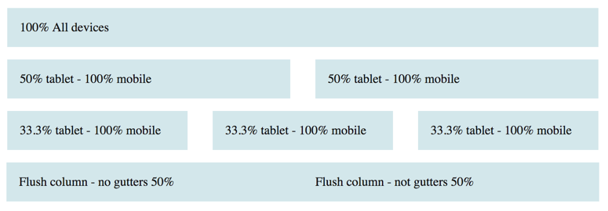

## Styled-Gel

[](https://travis-ci.org/dagda1/styled-gel)

[Bootstrap 4 Grid](https://v4-alpha.getbootstrap.com/layout/grid/) over [Styled Components](https://www.styled-components.com/).

Lightweight bootstrap like grid system for reactjs that uses [flexbox](https://css-tricks.com/snippets/css/a-guide-to-flexbox/).



## Dependencies
Built on top of and much `props` to:

- [react](https://facebook.github.io/react/)
- [styled-components](https://github.com/styled-components/styled-components)
- [styled-system](https://github.com/jxnblk/styled-system)

## raison d'etre
If like me, you still think about grids in terms of bootstrap, `Row`, `Col`, `xs`, `sm`, `md`, `lg` and `xl`, then look no further.

```sh
npm i --save styled-gel
```

## Usage

```jsx
import { Grid, Row, Col } from 'styled-gel';

export const MyComponent = () =>
  <Grid>
    <Row>
      <Col xs={12} md={3}>One</Col>
      <Col xs={12} md={3}>Two</Col>
      <Col xs={12} md={3}>Three</Col>
      <Col xs={12} md={3}>Four</Col>
    </Row>
  </Grid>;
```

## Breakpoints

styled-gel uses bootstrap 4's mobile first repsonsive breakpoints which are by default:

```js
export const breakpoints = {
  // xs:               0      - Extra small screen / phone
  sm:  '36em',    // > 576px  -  Small screen / phone
  md:  '48em',    // > 768px  -  Medium screen / tablet
  lg:  '62em',    // > 992px  -  Large screen / desktop
  xl:  '75em'     // > 1200px - Extra large screen / wide desktop
};

```

## Configuration

styled-system can be configured with styled-components to override the breakpoints, gutter width, background colour of the grid and number of columns in a row with more configuration options to come.

The following overridable theme options can be used to style a grid component:

| Property     | Description                                | Default value |
| :-------     |:-------------------------------------------| :-------------|
| columns      | number of columns a row is subdivided into | 12            |
| gutterWidth  | pixel width between columns                | 30px          |
| breakpoints  | the xs, sm, md, lg, xl values in em        | [36,49,62,75] |
| bodyBg       | Background Colour                          | inherit       |
| textColor    | font color                                 | inherit       |

```jsx
import { ThemeProvider } from 'styled-components'
import App from './App';

const theme = {
  bodyBg: #fff',
  textColor: '#333',
  fontFamily: '',
  gutterWidth: 20,
  columns: 13,
  breakpoints: [
    32, 48, 64, 128, 256
  ]
}

const App = props => (
  <ThemeProvider theme={theme}>
    <App />
  </ThemeProvider>
)
```

## Run Sample Project

```sh
npm start
```
## Run tests

```sh
npm test
```

Coming Next
- `xsOffset`, `xsPull`, `xsPush` etc.
- Responsive fonts
- Graceful degredation to `inline-block`.

MIT License
